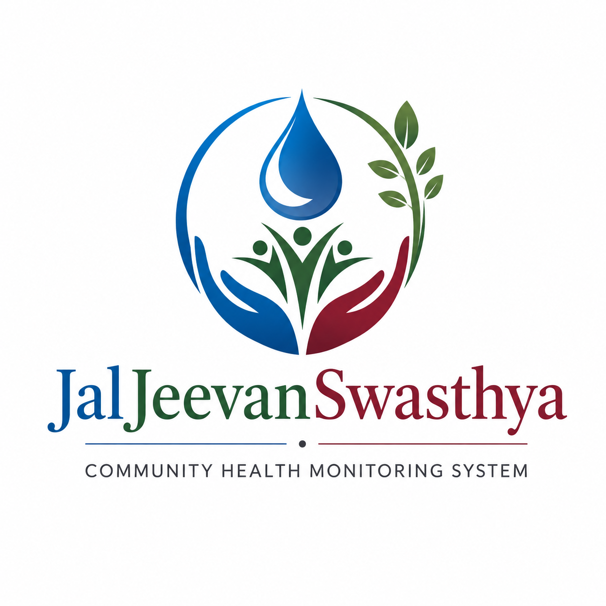

<a id="top"></a>
<div align="center">



# Jal Jeevan Swasthya

### Smart Community Health Monitoring & Early Warning System

**For Water-Borne Diseases in Rural Northeast India**

[](https://www.sih.gov.in)
[](https://nextjs.org)
[](https://react.dev)
[](https://fastapi.tiangolo.com)
[](https://www.postgresql.org)

[](https://jal-jeevan-swasthya-web.vercel.app)
[](https://jal-jeevan-swasthya-api.onrender.com/api/docs)
[](https://jal-jeevan-swasthya-api.onrender.com/api/health)

</div>

---

## 📋 About the Project

Water-borne disease outbreaks remain a critical health threat in rural Northeast
India, where limited infrastructure, delayed reporting, and a lack of predictive
tools allow diseases like cholera, typhoid, and hepatitis to spread unchecked.

**Jal Jeevan Swasthya** is a full-stack web application that empowers community
health workers to report disease cases in real time, monitor water quality
across villages, and review explainable 14-day outbreak forecasts before they
escalate — all accessible in 6 regional languages on any device.

> Built for **Smart India Hackathon 2025** — Problem Statement `SIH25001`

---

## 🌐 Live Demo

| Service | URL |
|---------|-----|
| **Frontend** | [https://jal-jeevan-swasthya-web.vercel.app](https://jal-jeevan-swasthya-web.vercel.app) |
| **Backend API** | [https://jal-jeevan-swasthya-api.onrender.com](https://jal-jeevan-swasthya-api.onrender.com) |
| **API Documentation** | [https://jal-jeevan-swasthya-api.onrender.com/api/docs](https://jal-jeevan-swasthya-api.onrender.com/api/docs) |

> ⏳ The API runs on Render's free tier and sleeps after ~15 minutes of
> inactivity. The first request may take up to a minute while it wakes up.

### 🔑 Demo Accounts

| Role | Email | Password | Capabilities |
|------|-------|----------|--------------|
| **District Admin** | `admin@healthwatch.gov.in` | `admin123` | Full access, manage upgrades, create alerts |
| **ASHA Worker** | `priya@healthwatch.gov.in` | `worker123` | Verify reports, submit water tests |
| **Block Officer** | `arup@healthwatch.gov.in` | `officer123` | Alerts, ML intelligence, upgrade reviews |
| **Volunteer** | `rahul@healthwatch.gov.in` | `volunteer123` | Submit disease reports, view dashboard |

These credentials are demonstration data only and must never be used for real
users.

---

## ✨ Key Features

<table>
<tr>
<td width="50%" valign="top">

### 📝 Disease Reporting
Volunteers and ASHA workers submit geolocated disease reports with symptoms,
severity, and water source — reviewed by staff before entering official stats.

### 💧 Water Quality Monitoring
Track pH, turbidity, coliform count, dissolved oxygen, and nitrate levels
across village water sources, with automatic contamination flagging.

### 🤖 Explainable Outbreak Forecasts
A Holt/SES exponential-smoothing ensemble (with an optional scikit-learn
regressor blend) projects cases 14 days ahead — complete with confidence,
risk drivers, and recommended actions.

### 🗺️ Interactive Risk Map
Leaflet-powered map with color-coded village markers and risk scores computed
from case density and water-quality findings.

</td>
<td width="50%" valign="top">

### 🔔 Alert Management
Auto-computed risk signals help block officers raise severity-tagged alerts
with recommended actions — every alert is resolved by a human, never by the model.

### 📊 Analytics Dashboard
Live district metrics — reports today, weekly trends, top diseases, active
alerts, and villages monitored at a glance.

### 🌍 6-Language Support
English, Hindi, Bengali, Assamese, Marathi, and Tamil through a custom
zero-dependency i18n layer with 211+ translation keys.

### 🔐 Role-Based Access Control
4-tier access model (Volunteer → ASHA Worker → Block Officer → District Admin)
with district-level data isolation and JWT authentication.

</td>
</tr>
</table>

---

## 📸 Screenshots

<table>
<tr>
<td align="center">
<br>
<b>Analytics Dashboard</b>
</td>
<td align="center">
<br>
<b>Interactive Risk Map</b>
</td>
</tr>
<tr>
<td align="center">
<br>
<b>Disease Report Form</b>
</td>
<td align="center">
<br>
<b>Outbreak Intelligence</b>
</td>
</tr>
<tr>
<td align="center">
<br>
<b>Alert Management</b>
</td>
<td align="center">
<br>
<b>Water Quality Testing</b>
</td>
</tr>
<tr>
<td align="center" colspan="2">
<br>
<b>Role Upgrade Requests</b>
</td>
</tr>
</table>

---

## 🛠️ Tech Stack

### Frontend

| Technology | Purpose |
|-----------|---------|
| Next.js 16 (App Router) | React framework, routing & SSR |
| React 19 | UI library |
| Tailwind CSS 4 | Utility-first styling |
| Zustand | Lightweight auth state management |
| Axios | HTTP client with JWT interceptor |
| Recharts | Dashboard charts & graphs |
| Leaflet + React-Leaflet | Interactive risk maps |
| oxlint | Fast linting |

### Backend

| Technology | Purpose |
|-----------|---------|
| FastAPI | High-performance async API framework |
| SQLAlchemy 2 | ORM with relationship mapping |
| PostgreSQL 16 | Production relational database (SQLite for local dev) |
| Redis (optional) | Distributed cache — falls back to in-process memory |
| python-jose | JWT token authentication |
| passlib + bcrypt | Password hashing |
| Pydantic v2 | Request/response validation & settings |
| Loguru | Structured logging |

### Machine Learning

| Technology | Purpose |
|-----------|---------|
| Holt / SES smoothing ensemble | Pure-Python 14-day case forecasting |
| scikit-learn (optional) | Random Forest regressor blended into predictions |
| NumPy | Numerical computation |
| joblib | Model serialization |

### Infrastructure

| Technology | Purpose |
|-----------|---------|
| Vercel | Frontend hosting & preview deployments |
| Render | API hosting + managed PostgreSQL (blueprint: `render.yaml`) |
| GitHub Actions | CI — lint, tests, production build |

---

## 🏗️ Architecture

```
┌──────────────────────────────────────────────────────────────┐
│                       CLIENT LAYER                           │
│  ┌──────────────┐  ┌──────────────┐  ┌───────────────────┐  │
│  │ Next.js 16   │  │ Leaflet Map  │  │ Recharts          │  │
│  │ App Router   │  │ (Risk Map)   │  │ (Dashboard)       │  │
│  └──────┬───────┘  └──────────────┘  └───────────────────┘  │
│         │ Axios + JWT bearer token                          │
│         ▼                                                    │
│  ┌──────────────────┐                                        │
│  │ Vercel (CDN)     │  jal-jeevan-swasthya-web.vercel.app    │
│  └────────┬─────────┘                                        │
└───────────┼──────────────────────────────────────────────────┘
            │ HTTPS (CORS-restricted)
┌───────────▼──────────────────────────────────────────────────┐
│                       SERVER LAYER                           │
│  ┌────────────────────────────────────────────────────────┐  │
│  │ FastAPI on Render  jal-jeevan-swasthya-api.onrender.com│  │
│  │  ┌─────────┐ ┌─────────┐ ┌────────────────────────┐    │  │
│  │  │ Auth    │ │ Reports │ │ Dashboard / Risk Map   │    │  │
│  │  │ (JWT)   │ │ (CRUD)  │ │ (Aggregation)          │    │  │
│  │  └─────────┘ └─────────┘ └────────────────────────┘    │  │
│  │  ┌─────────┐ ┌─────────┐ ┌────────────────────────┐    │  │
│  │  │ Alerts  │ │ Water   │ │ Forecast Engine        │    │  │
│  │  │         │ │ Quality │ │ (Holt/SES + RF blend)  │    │  │
│  │  └─────────┘ └─────────┘ └────────────────────────┘    │  │
│  │  Rate limiting · GZip · CORS · RBAC middleware          │  │
│  └────────────────────────────────────────────────────────┘  │
│         │                    │                               │
│  ┌──────▼──────┐    ┌───────▼─────────┐                      │
│  │ PostgreSQL  │    │ Redis           │                      │
│  │ (Render)    │    │ (optional —     │                      │
│  │             │    │ in-memory       │                      │
│  │             │    │ fallback)       │                      │
│  └─────────────┘    └─────────────────┘                      │
└──────────────────────────────────────────────────────────────┘
```

---

## 📁 Project Structure

```text
SIH-Hackathon/
├── 📄 README.md                    # This file
├── ⚙️ render.yaml                  # Render Blueprint (API + PostgreSQL)
├── 🧪 test_smoke.py                # End-to-end smoke test
├── 🖼️ screenshots/                 # UI screenshots used in this README
│
├── 📁 backend/
│   ├── 🚀 index.py                 # Vercel-compatible entrypoint (unused on Render)
│   ├── 📄 requirements.txt         # Runtime dependencies
│   ├── 📄 requirements-dev.txt     # + pytest, ruff, httpx test deps
│   ├── 🌱 seed_data.py             # Demo users, villages & reports seeder
│   ├── ⚙️ .env.example             # Environment variable template
│   └── 📁 app/
│       ├── 🚀 main.py              # FastAPI app factory, middleware, routers
│       ├── ⚙️ config.py            # Pydantic settings
│       ├── 🗄️ database.py          # SQLAlchemy engine & session
│       ├── 🕐 time_utils.py        # Timezone-safe helpers
│       ├── 📁 models/              # User, Village, DiseaseReport,
│       │                           #   WaterQuality, Alert, RoleUpgradeRequest,
│       │                           #   OutbreakPrediction
│       ├── 📁 schemas/             # Pydantic request/response schemas
│       ├── 📁 routes/              # auth, reports, water_quality, alerts,
│       │                           #   dashboard, villages, locations
│       ├── 📁 services/            # Health scoring, caching
│       ├── 📁 middleware/          # JWT auth, rate limiter
│       └── 📁 ml/                  # forecast.py, predictor.py, train.py
│
├── 📁 frontend/
│   ├── 📄 package.json             # Dependencies & scripts
│   ├── ⚙️ next.config.mjs          # Next.js configuration
│   ├── 🎨 public/                  # logo.png, icons
│   ├── 📁 app/                     # App Router pages (10 routes)
│   └── 📁 src/
│       ├── 📁 components/          # Layout, LanguageSelector
│       ├── 📁 views/               # Login, Register, Dashboard, Reports,
│       │                           #   RiskMap, Alerts, WaterQuality,
│       │                           #   Intelligence, UpgradeRequests
│       ├── 📁 store/               # Zustand auth store
│       ├── 📁 utils/               # Axios API client
│       ├── 📁 i18n/locales/        # en · hi · bn · as · mr · ta (211 keys)
│       └── 🎨 index.css            # Tailwind entry
│
├── 📁 docs/
│   └── 📄 JUDGE_DEMO.md            # 3-minute SIH demo script
│
└── 📁 .github/workflows/ci.yml     # CI pipeline
```

---

## 🚀 Getting Started — Beginner Guide

New to the project? Follow these steps exactly and you will have the app
running on your machine in about 15 minutes.

### Step 0 — Install the tools (once)

| Tool | Version | Download |
|------|---------|----------|
| **Node.js** | 22 or newer | [nodejs.org](https://nodejs.org) (LTS installer) |
| **Python** | 3.12 or newer | [python.org](https://www.python.org/downloads/) — tick *"Add Python to PATH"* during install |
| **Git** | any recent | [git-scm.com](https://git-scm.com) |

Verify each install opened in a fresh terminal:

```bash
node --version    # v22.x or newer
python --version  # 3.12.x or newer
git --version
```

You do **not** need to install PostgreSQL — local development defaults to a
file-based SQLite database created automatically.

### Step 1 — Get the code

```bash
git clone https://github.com/ayankunduixb-pixel/SIH-Hackathon.git
cd SIH-Hackathon
```

### Step 2 — Start the backend

**Windows (PowerShell):**

```powershell
cd backend
python -m venv .venv
.\.venv\Scripts\Activate.ps1
python -m pip install -r requirements-dev.txt
Copy-Item .env.example .env
python seed_data.py
python -m uvicorn app.main:app --reload --host 127.0.0.1 --port 8000
```

> If PowerShell blocks the activate script, run once:
> `Set-ExecutionPolicy -Scope CurrentUser RemoteSigned`, then retry.

**macOS / Linux:**

```bash
cd backend
python3 -m venv .venv
source .venv/bin/activate
python -m pip install -r requirements-dev.txt
cp .env.example .env
python seed_data.py
python -m uvicorn app.main:app --reload --host 127.0.0.1 --port 8000
```

✅ Checkpoint — open <http://localhost:8000/api/docs>: you should see the
interactive Swagger documentation.

### Step 3 — Start the frontend (second terminal)

**Windows (PowerShell):**

```powershell
cd frontend
Copy-Item .env.example .env.local
npm ci
npm run dev
```

**macOS / Linux:**

```bash
cd frontend
cp .env.example .env.local
npm ci
npm run dev
```

✅ Checkpoint — open <http://localhost:3000> and log in with any demo account
from the table above.

### Step 4 — Explore

Log in as different roles to see access control in action:

- `rahul@healthwatch.gov.in` / `volunteer123` → can only submit reports
- `priya@healthwatch.gov.in` / `worker123` → can also verify them
- `arup@healthwatch.gov.in` / `officer123` → can also manage alerts & forecasts
- `admin@healthwatch.gov.in` / `admin123` → sees everything

### 🔧 Troubleshooting

| Problem | Fix |
|---------|-----|
| `npm ci` fails | Delete `node_modules` and `package-lock.json`, run `npm install` |
| Frontend loads but shows *Cannot reach the API* | Make sure the backend terminal is still running on port 8000 |
| Port 8000 / 3000 already in use | Stop the other process, or change `--port 8000` / run `npm run dev -- -p 3001` |
| Login returns *Invalid credentials* | Run `python seed_data.py` inside `backend/` with the venv active |
| `Activate.ps1` blocked | `Set-ExecutionPolicy -Scope CurrentUser RemoteSigned` |
| Want a fresh empty database | Delete `backend/healthwatch.db` and rerun `seed_data.py` |

---

## 🚢 Deployment

Production runs on two platforms, configured in-repo:

| Service | Platform | URL |
|---------|----------|-----|
| Frontend | Vercel (root: `frontend/`) | [jal-jeevan-swasthya-web.vercel.app](https://jal-jeevan-swasthya-web.vercel.app) |
| API | Render Web Service (Blueprint: `render.yaml`) | [jal-jeevan-swasthya-api.onrender.com](https://jal-jeevan-swasthya-api.onrender.com) |
| Database | Render PostgreSQL (free plan) | provisioned by the blueprint |

**Redeploying:** push to `main`. Vercel rebuilds the frontend automatically;
Render redeploys the API on every push to the synced branch.

**First-time Render setup:** Render Dashboard → *New + → Blueprint* → pick this
repo → set `CORS_ORIGINS` to `["https://jal-jeevan-swasthya-web.vercel.app"]`.
Then point the Vercel env var `NEXT_PUBLIC_API_URL` at the Render URL.

Full details live in [`render.yaml`](render.yaml) and
[`backend/.env.example`](backend/.env.example).

---

## 📡 API Overview

Base URL (production): `https://jal-jeevan-swasthya-api.onrender.com`

| Method | Endpoint | Auth | Description |
|--------|----------|:----:|-------------|
| `POST` | `/api/auth/register` | — | Create a volunteer account |
| `POST` | `/api/auth/login` | — | Sign in, receive JWT |
| `GET` | `/api/auth/me` | ✅ | Current user profile |
| `POST` | `/api/auth/request-upgrade` | ✅ | Request a role upgrade |
| `GET` | `/api/auth/my-upgrade-request` | ✅ | Read own pending request |
| `GET` | `/api/auth/upgrade-requests` | 👮 | List upgrade requests |
| `PUT` | `/api/auth/upgrade-requests/{id}` | 👮 | Approve / reject an upgrade |
| `POST` | `/api/reports` | 📝 | Submit a disease report |
| `GET` | `/api/reports` | ✅ | List reports (district-scoped) |
| `GET` | `/api/reports/{id}` | ✅ | Report detail |
| `PUT` | `/api/reports/{id}/status` | ✔️ | Verify / reject a report |
| `POST` | `/api/water-quality` | 💧 | Submit a water test |
| `GET` | `/api/water-quality` | 💧 | List water tests |
| `POST` | `/api/alerts` | 👮 | Create an alert |
| `GET` | `/api/alerts` | ✅ | List alerts |
| `PUT` | `/api/alerts/{id}/resolve` | 👮 | Resolve an alert |
| `GET` | `/api/dashboard/summary` | ✅ | Dashboard metrics |
| `GET` | `/api/dashboard/risk-map` | ✅ | Village risk points |
| `GET` | `/api/dashboard/predictions/{district}/{disease}` | 👮 | 14-day ML forecast |
| `GET` | `/api/dashboard/trends/{village_id}/{disease}` | ✅ | Historical trend series |
| `GET` | `/api/villages` | ✅ | Monitored villages |
| `GET` | `/api/locations/reverse` | ✅ | Reverse geocoding helper |
| `GET` | `/api/health` | — | Liveness check |
| `GET` | `/api/ready` | — | Database readiness check |

Legend: ✅ any signed-in user · 📝 Volunteer + · 💧 ASHA Worker + ·
✔️ ASHA Worker + · 👮 Block Officer +

Interactive docs: [`/api/docs`](https://jal-jeevan-swasthya-api.onrender.com/api/docs)

---

## 🗄️ Database Schema

| Model | Table | Key Fields |
|-------|-------|------------|
| **User** | `users` | UUID id, name, email, role enum, district, coordinates |
| **Village** | `villages` | UUID id, name, block, district, population, coordinates |
| **DiseaseReport** | `disease_reports` | reporter, village, disease type, symptoms JSON, severity, status, risk score |
| **WaterQuality** | `water_quality` | village, tested_by, pH, turbidity, coliform, DO, nitrate, is_contaminated |
| **Alert** | `alerts` | title, severity, affected area, predicted cases, is_resolved |
| **RoleUpgradeRequest** | `role_upgrade_requests` | user, current → requested role, justification, status |
| **OutbreakPrediction** | `outbreak_predictions` | district, disease type, predicted cases, confidence, factors JSON |

---

## 🔐 Role-Based Access Control

Verified against `require_role(...)` guards in the route handlers:

| Capability | Volunteer | ASHA Worker | Block Officer | District Admin |
|------------|:---------:|:-----------:|:-------------:|:--------------:|
| Submit disease reports | ✅ | ✅ | ❌ | ❌ |
| Verify / reject reports | ❌ | ✅ | ✅ | ✅ |
| Submit water tests | ❌ | ✅ | ✅ | ❌ |
| View water tests | ❌ | ✅ | ✅ | ✅ |
| Create / resolve alerts | ❌ | ❌ | ✅ | ✅ |
| ML outbreak intelligence | ❌ | ❌ | ✅ | ✅ |
| Review role upgrades | ❌ | ❌ | ✅ | ✅ |
| Dashboard & risk map | ✅ | ✅ | ✅ | ✅ |

All data queries are additionally scoped to the user's own district.

---

## 🌍 Internationalization

| Code | Language | Native Name |
|------|----------|-------------|
| `en` | English | English |
| `hi` | Hindi | हिन्दी |
| `bn` | Bengali | বাংলা |
| `as` | Assamese | অসমীয়া |
| `mr` | Marathi | मराठी |
| `ta` | Tamil | தமிழ் |

211 translation keys covering every UI section, powered by a custom
zero-dependency i18n layer in `src/i18n`.

---

## 🧪 Testing & CI

Local checks (from the repository root):

```powershell
# Backend — unit + end-to-end smoke flow
python -m pip install -r backend/requirements-dev.txt
python -m pytest test_smoke.py -q -W error::DeprecationWarning
python -m ruff check backend test_smoke.py --select F

# Frontend — lint + production build
cd frontend
npm ci
npm run lint
npm run build
```

GitHub Actions runs exactly these checks on every push and pull request to
`main` (see [.github/workflows/ci.yml](.github/workflows/ci.yml)). The smoke
test exercises the full flow: seeding, registration, login, report submission,
verification, water tests, alerts, dashboard aggregation, and forecasting.

---

## ⚠️ Safety Note

Forecasts are decision-support signals, **not** diagnoses. Predictions carry a
confidence value that reflects data sufficiency, and no alert is ever published
automatically — public-health action must always be reviewed and approved by a
qualified official.

---

## 🤝 Contributing

1. Fork the repository
2. Create a feature branch (`git checkout -b feature/amazing-feature`)
3. Commit changes (`git commit -m 'Add amazing feature'`)
4. Push to the branch (`git push origin feature/amazing-feature`)
5. Open a Pull Request — CI must pass before merge

---

## 🙏 Acknowledgements

- **Smart India Hackathon 2025** — Problem Statement SIH25001
- **OpenStreetMap contributors** — map tiles for the Leaflet risk map
- **Nominatim** — reverse geocoding services
- All the community health workers of Northeast India who inspired this project

---

<div align="center">

**Built with ❤️ for the communities of Northeast India**

[⬆ Back to Top](#top)

</div>
